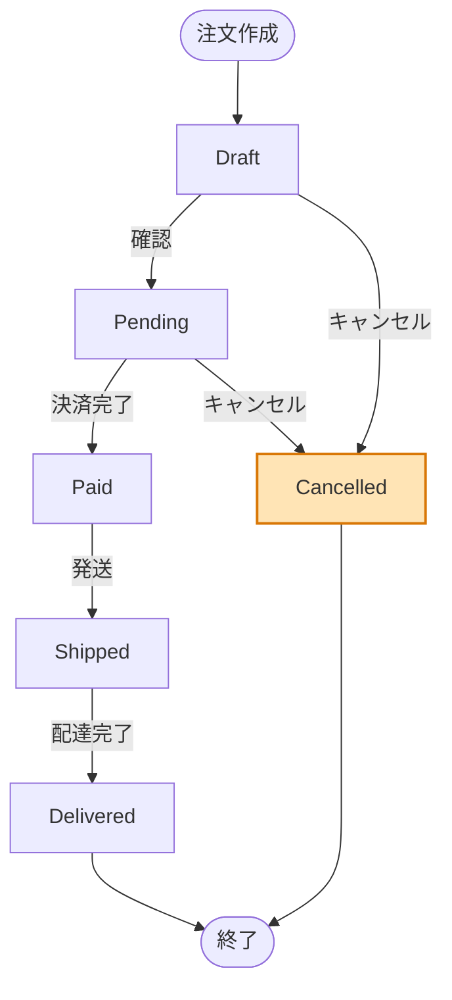

# プルリクエストテンプレート

## 概要

<!-- このプルリクエストで何を変更したかを簡潔に説明してください -->

## 変更内容

### 🎯 変更の種類

<!-- 該当するものにチェックを入れてください -->

- [ ] 🐛 バグ修正 (Bug fix)
- [ ] ✨ 新機能 (New feature)
- [ ] ♻️ リファクタリング (Refactoring)
- [ ] 🎨 UI/UX 改善 (UI/UX improvement)
- [ ] 🐎 パフォーマンス改善 (Performance improvement)
- [ ] 🚨 テスト追加/修正 (Tests)
- [ ] 📖 ドキュメント更新 (Documentation)
- [ ] 🔧 設定変更 (Configuration)
- [ ] 🗑️ 削除 (Removal)

### 📝 詳細な変更内容

<!-- 以下の形式で変更内容を記載してください -->

#### 追加された機能・修正

-

#### 変更されたファイル

-

#### 削除されたファイル・機能

-

## 🧭 意思決定と経緯

<!--
テンプレート(.pr-template.yml)の decision_record.mode に従って記載する。
mode が off の場合はセクションごと削除する。
各コミット本文の意思決定は以下で集められる:
  git log <base_branch>..HEAD --format=%B
コミット本文の丸写しではなく、PR全体としての方針判断に束ね直すこと。
-->

### 背景

<!-- この変更が必要になった経緯・課題・制約（mode: standard 以上） -->

-

### なぜこの方針か

<!-- PR全体として採用した方針とその理由（mode: minimal 以上） -->

-

### 検討した代替案

<!-- 採用しなかった案と却下理由をセットで記載（mode: detailed）
     却下理由のない列挙はレビュアーの判断材料にならないため必ず添えること -->

- 案:
  - 却下理由:

### 影響とトレードオフ

<!-- 既存挙動・互換性・運用への影響と、受け入れたトレードオフ（mode: standard 以上）
     利点だけを並べず「何を犠牲にしたか」を書くこと -->

-

### 今回見送ったこと

<!-- スコープ外にした項目と理由。後続Issueがあれば番号を併記（mode: detailed） -->

-

## 📊 システム図

<!-- テンプレート(.pr-template.yml)で diagrams が有効な場合のみ記載。無効の場合はセクションごと削除 -->

### 状態マシン / フロー図

```
{ここに状態マシン図またはフロー図を記述すること}
{すべての状態・遷移条件・分岐を含めること}
{変更箇所には [NEW] や [CHANGED] で注釈をつけること}
```

<!--
例 (Mermaid flowchart — デフォルトはこれ):



例 (ASCII art — flowchart で収まらない場合のフォールバック):

```
                 ┌─────────┐
                 │  Draft  │
                 └────┬────┘
                      │ 確認
          キャンセル   │
     ┌────────────────┤
     │                ▼
     │          ┌──────────┐
     │          │ Pending  │
     │          └────┬─────┘
     │               │
     │    ┌──────────┤
     │    │ キャンセル │ 決済完了
     ▼    ▼          ▼
┌───────────┐  ┌──────────┐
│ Cancelled │  │   Paid   │
│   [NEW]   │  └────┬─────┘
└───────────┘       │ 発送
                    ▼
              ┌──────────┐
              │ Shipped  │
              └────┬─────┘
                   │ 配達完了
                   ▼
              ┌───────────┐
              │ Delivered │
              └───────────┘
```
-->

### データフロー

```
{ここにデータフロー図を記述すること}
{コンポーネント間のデータの流れを含めること}
{変更箇所には [NEW] や [CHANGED] で注釈をつけること}
```

<!--
例:

```
Client (POST /orders/:id/cancel)
    ↓
OrderController.cancel()
    ↓
OrderService.cancel()
    ├─→ OrderRepository.updateStatus(id, 'cancelled')  [NEW]
    │       ↓
    │   Database (orders テーブル)
    │
    └─→ NotificationService.sendCancelEmail()  [NEW]
            ↓
        Email送信 (ユーザーへキャンセル通知)
```
-->

## 📋 関連 Issue

<!-- 関連するIssueがある場合は記載してください -->

- GitHub の PR 画面「Development」セクションで、関連する Issue を必ず Link してください（Linked issues）。
- 本文にも連携キーワードを記載してください:
  - 閉じる場合: `Closes #<番号>` または `Fixes #<番号>`
  - 参照のみ: `Refs #<番号>` または `Relates to #<番号>`

例:

- Closes #123
- Refs #456

## 🧪 テスト

### テスト実行方法

```bash
# テストコマンドを記載
```

### テスト項目

<!-- 実施したテストについてチェックしてください -->

- [ ] 単体テスト (Unit tests)
- [ ] 統合テスト (Integration tests)
- [ ] E2E テスト (End-to-end tests)
- [ ] 手動テスト (Manual testing)

### テスト結果

<!-- テスト結果を記載してください -->

## 📸 スクリーンショット/動画

<!-- UI変更がある場合は、Before/Afterのスクリーンショットや動画を添付してください -->

### Before

<!-- 変更前のスクリーンショット -->

### After

<!-- 変更後のスクリーンショット -->

## 🔍 レビューポイント

<!-- レビュアーに特に注目してもらいたい点を記載してください -->

-
-
-

## ⚠️ 破壊的変更

<!-- 破壊的変更がある場合はチェックして詳細を記載してください -->

- [ ] この変更は既存の API に破壊的変更を含みます

### 破壊的変更の詳細

<!-- 破壊的変更がある場合、その詳細と移行方法を記載してください -->

## 📚 追加情報

### 参考資料

<!-- 参考にした資料やドキュメントがある場合は記載してください -->

-

### 注意事項

<!-- レビュアーや今後のメンテナンスで注意すべき点があれば記載してください -->

-

## ✅ チェックリスト

<!-- プルリクエストを出す前に以下をチェックしてください -->

- [ ] コードレビューの準備ができている
- [ ] テストが正常に実行される
- [ ] ドキュメントが更新されている（必要に応じて）
- [ ] コミットメッセージが適切な形式で書かれている
- [ ] 関連する Issue が PR の「Development」に Linked されている
- [ ] PR 本文に `Closes #` / `Fixes #` / `Refs #` などで Issue が記載されている
- [ ] セルフレビューを実施した
- [ ] 意思決定と経緯を記載した（`decision_record.mode` が `off` 以外の場合）
- [ ] 破壊的変更がある場合は明記されている

## 🤝 レビュアーへのお願い

<!-- レビュアーに対する特別なお願いがあれば記載してください -->

-
-

